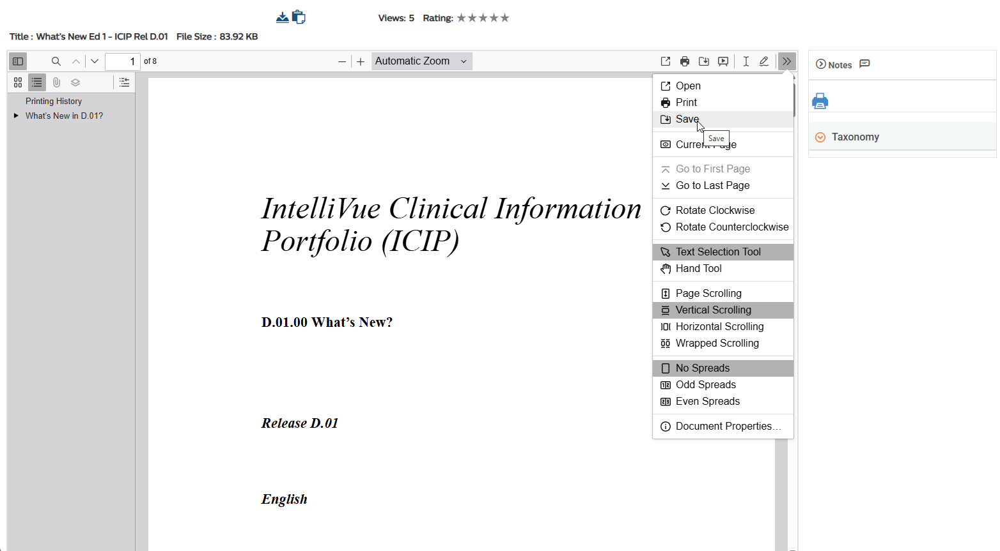

# Philips InCenter PDF Enhancer (Tampermonkey Script)

This Tampermonkey userscript enhances the built-in PDF viewer on the Philips InCenter platform by adding the following extra buttons:

- **Open File** – Open a local PDF file in the viewer
- **Print** – Print the currently loaded PDF
- **Download** – Download the currently loaded PDF
- **Text** – Toggle text selection mode
- **Draw** – Enable a drawing mode for annotations (freehand)

## 🧩 Features

✅ Adds user-friendly buttons directly to the PDF toolbar
✅ Adds additional options to dropdown menu
✅ No changes to the original page layout  
✅ Works seamlessly within the InCenter PDF viewer  
✅ Helps users interact more easily with documents

## 📥 Installation

1. Install [Tampermonkey](https://www.tampermonkey.net/){:target="_blank"} browser extension (if you haven't already).

2. Set permission to execute userscripts

   👉 [Instructions](https://www.tampermonkey.net/faq.php#Q209){:target="_blank"}

2. Click the link below to install the script:

   👉 [Install the Script](https://github.com/igorlovric/Tampermonkey-Philips-InCenter/raw/refs/heads/master/Philips-Incenter.user.js){:target="_blank"}

3. Open a PDF document on the Philips InCenter platform. The new buttons will appear automatically.

## 🖼️ Screenshot

## ⚙️ How It Works

The script unhides HTML elements in the toolbar of the PDF viewer. It detects when the viewer is loaded and adds functionality dynamically.

## 📄 Compatibility

- ✔️ Google Chrome
- ✔️ Mozilla Firefox
- ✔️ Microsoft Edge
- ❌ Not tested on Safari

## 🔒 Disclaimer

This script is provided as-is and is not affiliated with or endorsed by Philips or the InCenter platform. Use at your own risk.

## 🛠️ Development

If you'd like to improve this script or customize it, feel free to fork the repository or open an issue.

## 📝 License

[MIT License](LICENSE.md)

---
